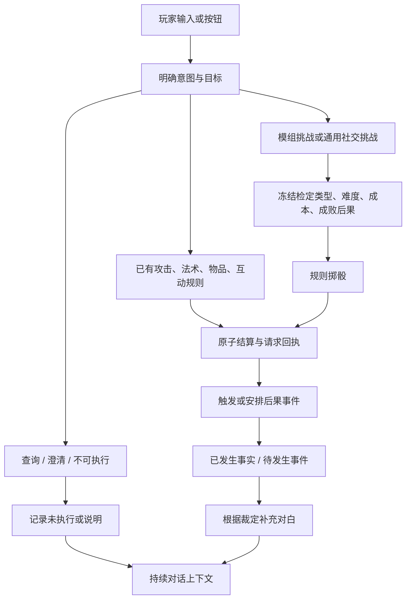

# 行动裁定与后果事件 V1

最新实现与阶段状态见 [第二阶段完整冒险](phase2-adventure.md)，下文保留前版设计记录。

交互更新：明确按钮直接结算，文字对话/挑战保留受控叙事；简短提示与规则详情分开。见 [交互性能重构](interaction-performance.md)。下文裁定与事件语义保持有效。

玩家声明意图，主持选择结构化行动或挑战，规则结算，再生成对白。行动尝试、实际发生的事件、尚未发生的事件分别保存。本文取代旧版“自由回复即可完成一轮”和针对攻击用词逐个拦截的方案；基础战斗、友方保护与当前冒险内容保持原有边界。

## 玩家可以感受到什么

- 普通观察和说明标为“说明”，拒绝标为“未执行”，澄清标为“待明确”，不再把所有回复标成“自动成功”。
- “再试一次”引用最近一次明确行动；被拒绝的攻击仍然被拒绝，不会编造成躲闪、反击或鼓励玩家出发。换地点或切换战斗状态后必须重新明确目标。
- 在场的和平 NPC 支持说服、欺瞒、威吓、表演这四类初始社交挑战。当前目标是影响态度；成功不代表强迫交物品、泄露秘密或完成任务。
- 挑战面板提前展示难度、时间成本和后果，文字输入与按钮使用相同规则。默认社交挑战 DC 15，成功关系 +1、失败 -1，关系限制在 -5 至 +5。
- 同一 NPC 的四种社交方式共享重试限制。新线索、剧情条件变化，或交涉间隔结束后可再试；换一句话或换技能不能立即刷骰。默认间隔为两格有效探索时间，由真实事件驱动。
- 事件栏显示倒计时与已发生、取消、失效记录，探索和战斗共用。查看界面与普通交谈不推进时钟。

默认社交参数是本项目的轻量设计，不是声称 D&D 原版规定“所有社交 DC 15”。后续可根据试玩调整；模组中的独立挑战可以使用自己的难度、风险与后果。

## 裁定与工具协议

现有工具 `act` 只能选择当前动作目录，`inspect` 只能读取当前允许的信息。新增：

- `adjudicate`：提交 attack/challenge/observe/unavailable，附目标、目的、方法；challenge 必须引用当前可见挑战，并且目标一致。不接受自定义 DC、骰点或效果列表。
- `clarify`：提出必要问题，记录为待明确。
- `retry`：引用已保存的行动，而不是模型对白；常见“再试一次”在本地直接恢复，不需要再次调用模型。
- `respond`：用于只读解释或已结算后的叙述；执行意图的规划阶段不开放直接叙述结果。

攻击意图可以正常提交给规则，即使目标不可攻击。规则拒绝后保存目标和未执行状态，不触发攻击动画式叙述。友方/中立攻击依然禁用。对真实敌人的文字攻击使用先攻与已有武器攻击规则，不替换成力量技能检定。

`gm/skills.py` 提供交谈、探索、战斗、连续性的可复用流程说明。它们是游戏主持的工作流程，权限仍由代码决定；不引入新的 agent 框架或任意脚本执行。原有问路/明确称呼识别作为辅助约束保留，不承担世界状态授权。

## 规则来源及范围

本地有 SRD 5.2.1 和 5.1 PDF，分别位于 `research/raw/dnd5e/`。规则研究以 5.2.1 为主、5.1 交叉参考；不是完整复制商业规则书。

遵循“有不确定性且失败有意义才检定”的原则，区分属性检定、攻击检定与豁免。现有场景互动和新增挑战共用 `game/checks.py`；攻击继续使用战斗规则。属性检定依据相关技能计算熟练，豁免依据当前三个职业的豁免熟练；不会把技能熟练误加到豁免。普通检定的自然 20 不自动越过 DC，攻击的重击沿用现有规则。

`ChallengeDefinition` 明确 check_kind、skill/ability、dc、risk、stakes、time_cost、retry、required_flags、on_success/on_failure。automatic 不掷骰；有检定必须提供失败后果。检定前复制完整计划，成功也可以付出成本，失败也可以安排后续线索。

当前不允许 AI 临时编造任意挑战并自行决定奖励。自由输入首先匹配已有规则或挑战；没有适用规则时明确说明尚不能执行。开放动作理解与无限世界生成是不同的完成范围。

## 事件模型

`EventSpec` 同时用于模组事件和挑战后果。维度相互独立：

| 字段 | 当前取值 / 行为 |
| --- | --- |
| category | social / environment / quest / combat |
| scope | personal / scene / region / story；描述影响范围，不授予额外修改权限 |
| priority | critical / urgent / normal；只决定本批次已到期事件的处理顺序 |
| clock / delay | world 为场景时间格，combat 为完整战斗轮 |
| required_flags | 安排及到期时检查前置条件；到期失效不会擅自执行 |
| wait_for_conditions | 条件未满足时继续等待；满足后在同一结算批次重新评估，不必再发一条消息 |
| cancel_flags | 任一取消条件满足即取消 |
| scene_id / cancel_on_leave | 限定地点；离开时取消，或等待返回对应地点 |
| after_combat | continue 转成剩余世界时间，cancel 随战斗结束取消 |
| visible | 隐藏事件不进入主持上下文和事件栏 |
| effects | 关系、伤害、状态、标记、物品、线索、进入现有遭遇 |

效果只使用声明的类型和合法实体引用。关系单次 -2 至 +2；状态只支持现有鼓舞/中毒；物品必须来自内容包；遭遇只能在指定真实场景发起，使用其中现存的全部活敌人，不能创造 NPC 或强行移动玩家。数量/目标/多余字段不符时拒绝。

已经发生的事件写入 `event_facts`；待发生事件保存完整效果快照、来源、到期时刻、战斗 ID 和状态。每次有效命令结算后检查取消与到期；事件 ID 防止重复触发，完成载荷保留最近 80 项，待发生事件上限 64。

时钟约定：一格探索时间暂按 60 秒折算，一轮战斗按 6 秒。战斗里原有界面的 `scene.time` 行动计数继续保留，事件不会把它误算成一分钟，也不会与战斗轮重复累计。附赠动作不等于完成一整轮。转换单位属于本项目调度约定，不是宣称每种 D&D 探索行动恰好一分钟。

事件以命令/完整战斗轮边界处理，没有墙上时钟后台线程；关网页不会暗中消耗时间。没有远近、警戒或察觉系统。优先级不改变已有先攻次序。大型故事分支、任意生成人物/地图及开放战役导演仍后置。

## 记忆、保存与接口

- `discourse`：最近明确行动、对象、说话人、结果、待澄清问题。
- `action_attempts`：最近 40 次尝试，包括拒绝与失败；目的不会被当成完成事实。
- `event_facts`、`scheduled_events`、`event_clock`：分别保存事件事实、未来事件与游戏时间。
- `relationships`、`challenge_attempts`：实际关系与重试依据。
- 原有对白 `gm_turns` 作为非权威历史提供，不能覆盖规则结果。模型叙事注释不改世界状态。

所有新字段有默认值，旧存档可继续。启动优先恢复原默认会话，不能因为另一份存档较新就覆盖它；更新前备份与更新后字段核对确认原冒险进度保留。旧历史缺少明确行动记录时，首次“再试一次”会要求明确动作，不尝试猜测过去错误对白。

`POST /commands` 新增 `kind=challenge, target_id=<挑战 ID>`；既有文字入口自动选择同一服务。`GET /exploration` 包含可用挑战、关系与事件概览；`GET /events` 提供时钟、可见待发生事件、事实与已解决状态。查看接口只读。

请求回执与裁定、事件在同一事务内保存；模型回应中断不会重复掷骰、消耗时间或发放事件奖励。事件效果校验失败时回滚整个命令。旧地图、背包、休息 HTTP 入口也归到统一命令事务。

未来编辑器和 StoryParser 输出 `ModulePack`，复用 `SceneDefinition.challenges` 与 `events`，不另造执行协议。`docs/module.schema.json` 已同步。可导入示例见 [月桥：事件与裁定示例](examples/event-workshop.json)：解读便笺成功立即获得线索，失败则安排两格时间后的线索事件。不会自动导入或替换玩家现有内容快照。

## 验证

本轮集中检查未执行攻击及重试、上下文污染、检定参数越权、成功仍付成本、自动行动不掷骰、豁免、倒计时、优先级、取消/失效、遭遇重入、存读档、异常回滚与重复请求。

真实模型的独立验收脚本 `scripts/accept_adjudication.py --live` 完成 8 轮：攻击拒绝、重试、只读问题、说服成功、禁止立即重掷、有效时间推进、欺瞒失败、读档与继续交谈；共 8 次模型调用，输入 37,016 / 输出 711 tokens，0 次降级。骰点固定用于验证不同分支，不能当作随机胜率。

完整旧冒险本轮前 17 轮通过，在进入战斗后的第一次规划遇到供应商拒绝空 enum；已改为无候选时只允许 null，并单独重跑战斗流程：6 轮、13 次调用、输入 37,112 / 输出 533 tokens、无降级。随后补齐退出战斗的明确结果与已执行命令上下文，避免把“已返回探索”误说成“可以领取结算”。最终后端 714 项通过，前端构建/lint/3 项请求恢复检查通过。独立浏览器验证挑战、关系、未执行标签、刷新原话和倒计时，无控制台错误；实际服务已更新，验收服务已关闭。

已知限制：对白校验仍不是语义正确性的数学证明；模型可能写得啰嗦或附带多余指引。当前自由度主要体现在行为理解、规则选择及结果叙述，持续世界变化来自受控事件效果。不要把本轮描述为无限自动生成战役已完成。
