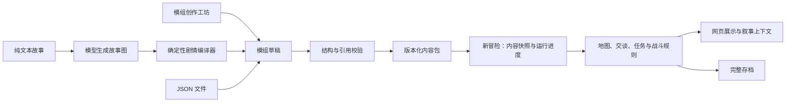

# 内容契约、故事编译与运行状态

2026-09-09：故事、地图、人物、装备物品、任务、事件与结局共用版本化 `ModulePack`。创作工坊已支持分类编辑、复制现有模组、草稿保存与恢复、校验、导出、导入和独立试玩。原有冒险保存自己的内容快照，编辑草稿不会改变游玩中的进度。

纯文本经模型生成 `StoryGraph`，确定性编译器再生成 `ModulePack`。模型描述地点、人物和事件依赖，编译器负责进度标记、一次性结果、任务交付和结局条件。充值后的百炼已通过短篇三路线 AI 流程，完整故事也已产出可编译草稿；但倒计时取消关系等语义仍在复核，结构检查通过不能代替故事语义检查。

## 故事编译边界

- 剧情事件支持抵达、交谈、主动互动、鉴定和清空敌人；鉴定必须包含技能/属性、风险与失败结果。
- 成功与失败的依赖分别记录；拒绝不存在的引用、循环和同时要求同一次鉴定成功与失败的矛盾条件。故事地点必须从起点可达。
- `requires` 表示全部满足，`requires_any` 表示任选其一，两者同时约束。编译器将 OR 汇合编译为各前置结果产生的共享标记，沿用原规则。自动事件与检定在 Schema 中分型，自动事件不能携带检定或失败字段。
- 场景互动遵守模组 `time_cost`；全故事/区域倒计时不要求玩家仍处于起始地点；`cancel_after` 属于待发生的延迟后果，不能反写在已立即发生的行动上。
- 奖励、伤害、关系、状态、线索和遭遇使用各自的结构；经验只由任务奖励发放。事件支持倒计时、优先级、作用范围和取消条件。
- 原始 `ModulePack` 编辑仍保留完整能力；不能用模型漏写或简化后的故事代替作者原意。
- 解析失败时保留原稿、已生成的故事结构、补全假设和待确认问题。未应用的 JSON 编辑也能保存；恢复后需先应用文件才能导出、导入或试玩，避免误用上一次有效内容。

裁定、工具权限、事件和记忆见 [行动裁定与后果事件](adjudication-events.md)；完整交付范围及证据见 [交付计划](release-plan.md)。

## 数据如何进入游戏

内容包描述世界；会话保存玩家造成的变化。编辑已导入模组不会悄悄改变正在玩的冒险：每个新冒险持有内容快照，存档也保存这份快照。导入版本目前不可覆盖，修改后以新 ID 导入。

文本解析器只负责产出草稿，不能直接改 HP、发奖励或切换场景。`/modules/parse` 支持自然语言、故事结构修复和 JSON 校验。原稿可粘贴或上传 TXT/Markdown；JSON 文件可上传并编辑。需要作者确认的信息随草稿保留。

最新扩展：内置 1.1.0 增加内容驱动结局、任务经验、补给与状态定义；网页命令/事实边界见 [基础游戏 V1](base-game-v1.md)。下表同步当前 Schema，旧回归数字仅代表第一轮时点。

## 内容格式支持的配置范围

| 内容 | 当前可配置 | 当前边界 |
| --- | --- | --- |
| 冒险 | ID、版本、名称、介绍、起点 | 一个内容包一个冒险；没有热更新或依赖模组 |
| 地图 | 场景描述、名称与别名、有向出口、人物与物品引用 | 仍为地点图；没有站位、距离或渲染坐标 |
| 人物 | 名称、描述、态度、存活标记、属性、HP、AC、武器、对话与线索 | 人物是独立实例，同一 ID 不能同时放在多个场景；玩家职业构筑仍由基础规则定义 |
| 装备和物品 | 武器伤害/属性，护甲 AC，治疗效果骰，普通物品说明 | 消耗效果支持治疗与解毒；没有任意脚本效果 |
| 敌人奖励 | 经验、掉落物品、数量和概率 | 和平 NPC 被攻击后仍不提供刷取奖励 |
| 任务 | 委托人、清理场景或事件标记目标、物品与经验奖励、条件替代路线 | 支持 `clear_scene` 与 `flags`；交付和奖励由规则系统处理 |
| 场景互动 | 技能、DC、成败叙事、失败伤害、物品与线索奖励、状态、优势来源和前置标记 | 成功只结算一次，失败可重试；进度按场景保存 |
| 结局/补给 | 结局条件及叙事、补给物品与初始数量、安全休息地点 | 固定规则，不支持任意脚本 |
| 事件 | 进入场景、交谈、清理场景；前置标记、设置标记、叙事与物品奖励 | 事件执行一次，进度随存档保存；尚未支持生成 NPC、动态出口等效果 |

校验会拒绝未知字段/版本/效果类型、缺失引用、重复人物放置、歧义地点别名、重复出口方向、不合法装备数值与骰式、不能交谈的委托人等。原始模组审阅会提示不可达地点和没有产生来源的目标标记；故事编译器另行拒绝不可达地点和依赖循环。两者都不能证明模型忠实保留了原故事。

## 清理与修复

- 服务入口只组装路由；存档、状态、模组接口各自只有一处注册，移除未使用的重复战斗路由实现。
- `src/scene.py`、`src/scene_map.py` 和旧 `src/scenes/data.py` 读取同一内容来源；旧导入路径保留薄适配层。修复“森林入口”被误指向地下城的别名。
- 删除与 `src/npc/` 包同名的 `src/npc.py` 和动态加载补丁。人物使用统一模型，对话记录直接属于会话，读取存档后不会另起一份空历史。
- 模组面板移除三个演示模组，显示实际目录。激活返回新的会话，创建同名同职业的 1 级角色，原会话与存档保留。
- 当前剧情、任务面板与叙事上下文读取相同的内容和进度；移除另一套按文字关键词推进故事的调用。
- 地图、场景拾取、交谈、战斗属性、掉落和经验读取当前冒险内容。自定义治疗物品在背包和战斗中使用同一个效果处理器，效果随物品一起存档。
- `/load` 与 `/load/{save_id}` 都恢复完整快照；旧 `passage_quest` 迁移为任务状态字典。修复 `/state` 将已消耗生命骰显示成满值，以及存档里伪造固定战斗编号和回合的问题。
- 构建产物包含内容 JSON 与实际战斗路由，避免离开源码目录后丢失内容。

## 接口

以下路径均为后端路径；本地网页通过 `/api` 代理访问。玩法和激活请求携带 `X-Session-Id`。

| 接口 | 输入/输出 |
| --- | --- |
| `GET /modules` | 真实目录与当前冒险信息 |
| `GET /modules/{id}` | 完整内容包 |
| `GET /modules/schema` | 当前 JSON Schema |
| `POST /modules/validate` | 直接提交 JSON 对象，返回 `valid`、`issues`，合法时返回标准化 `module` |
| `POST /modules/parse` | `format=text` 调用模型生成故事图再编译；`story_graph` 直接修复并编译故事图；`json` 校验原始模组。`source` 为文本，返回草稿、问题及审阅结果 |
| `GET/POST /modules/drafts` | 读取/保存草稿、原稿、作者问题及可选的未应用文件 `pending={format,source}`；无效草稿可保留但不能直接运行 |
| `POST /modules/import` | 提交合法内容包；相同内容幂等，不同内容占用同一 ID 返回 409，非法内容返回 422 |
| `POST /modules/activate` | `{ "module_id": "..." }`，返回新 `session_id` 与冒险信息；当前战斗需先结束 |
| `POST /modules/{id}/activate` | 同一激活操作的兼容路径 |

`MODULE_DIR` 可指定导入目录。旧 `/modules/load`（服务器文件路径读取）、`/modules/deactivate` 和旧故事节点数据格式不属于新接口。切换内容通过启动新冒险完成。

完整示例：[月桥委托](examples/moon-bridge.json)。结构参考：[JSON Schema](module.schema.json)。内置内容：`app/backend/src/content/builtin.json`。示例只作为文档提供，没有导入用户的实际模组目录。

## 历史迁移记录（2026-09-06）

2026-09-06 最新回归：后端 **613 项通过、0 失败/跳过、无收集错误**，前端构建与 lint 通过。旧契约、重复验收已清理，实际缺陷已修复；详见 [测试清理记录](test-maintenance.md)。内置内容升级到 1.0.1，新增可选场景互动定义；Schema 已同步。产品中未定义/后置能力仍不视为完成。

仍保留 `models/module.py`、`modules/manager.py`、`save_load/` 等旧格式的独立适配与测试；它们不再控制新模组的在线游戏状态。下一轮应逐项确认旧格式的迁移需求后退役，继续收敛尚存的通用 `/action` 与特殊社交行为，避免一次删除破坏旧存档。
