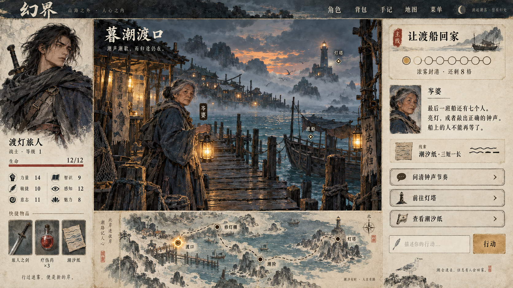

# 幻界：游戏视觉方向与信息布局复核

本文件保留初始调研。用户随后确定：默认基调为西方奇幻，平台支持多风格，默认外观完整免费，作者可上传并替换素材，未来按图付费生成。已按此实施，当前范围与接口以 [视觉平台 V1](visual-platform-v1.md) 为准。早期偏武侠的概念稿只保留构图参考，未作为游戏默认美术。功能验收不能等同于视觉体验通过。

## 当前问题

1. 大面积空白节点图占据主画面，缺少可感知的具体世界；多数功能被藏进顶栏和弹窗，玩家需要凭记忆理解状态。
2. 角色、场景、道具没有统一的插画资产；色彩与边框承担了本该由构图、材质和形象承担的辨识度。
3. 对话、系统提示、结局等都是相似文本块，当前行动与历史缺少明确层次。
4. Phaser 确实接入了，但主要负责地图、镜头、节点选择与战斗先攻展示。AdventureInterface 的主要叙事和操作仍以 HTML 元素呈现。把生命周期交给 Scene 并不会自动得到游戏演出。
5. 之前精简过度。应减少解释和重复信息，而不是把生命、当前任务、时间压力、可交互人物与行动等决策信息都隐藏。

源码依据：app/frontend/src/game/adventureEngine.ts、atlasEngine.ts、interface.ts、adventure.css。保留可访问的 HTML 中文阅读和输入层是合理技术选择，不能拿“是否全部画进 Canvas”衡量美术质量。

## 官方参考与可迁移原则

| 参考 | 官方资料与本项目借鉴 | 不照搬的部分 |
| --- | --- | --- |
| Roadwarden | 官方将其定义为插画文字 RPG，结合对话、角色能力、背包、资源与时间任务。借鉴有内容密度的长阅读组织和稳定的场景视觉。官方还明确说明长时间阅读下像素字体并非最舒适的选择。 | 不强制使用像素画或像素中文，不复制界面与资产。 |
| Disco Elysium | 官方 Feld 开发日志明确：菜单围绕世界观中的机器设计，掷骰有快进动画、灯光和声音。借鉴界面材质、文字与反馈共享一个视觉设定，重要判定有简短演出。 | 不照搬它的题材与大量特殊字体，也不以装饰损害阅读。 |
| Citizen Sleeper | 官方说明 Dice、Clocks、Drives 共同组织行动、事件压力和目标。借鉴同时看到行动资源、人物关系线索、时间压力和目标的决策呈现。 | 不复制骰子分配规则或科幻终端外观；幻界继续既有 DND 风格检定与先攻规则。 |
| Book of Hours | 官方提供叙事管理玩法与美术参考。作为插画、书页和物件语言的补充方向。 | 不将幻界改成大量卡片自由堆叠的桌面管理玩法。 |

来源（2026-09-09）：
- [Roadwarden 官方介绍与截图](https://moralanxietystudio.com/roadwarden)
- [Roadwarden 官方 press kit](https://moralanxietystudio.com/presskit/roadwarden)
- [Disco Elysium：Feld Playback Experiment](https://discoelysium.com/devblog/2016/12/20/feld-playback-experiment)
- [Citizen Sleeper 官方商店介绍](https://store.steampowered.com/app/1578650/Citizen_Sleeper/)
- [Book of Hours 官方页面](https://weatherfactory.biz/book-of-hours/)

以上迁移建议是设计判断，不是这些游戏的官方推荐。通用 UI 技能检索给出的企业字体、转化率布局和超写实3D不适合本项目，不采用；只使用其基本可读性、焦点与动效约束。

## 推荐方向：手绘奇幻旅行志

目标是有完整插画辨识度、信息丰富但阅读清楚的2D叙事RPG。通用界面保持一致，具体模组通过场景、肖像和少量强调色表达自己的地域气质。

- 构图：场景是主视觉；人物有可记忆的肖像；正文是稳定阅读区；地图有地貌、地标和道路。
- 笔触：统一的水粉/淡彩、墨线与轻微纸感。细节集中在风景、脸部和重要道具，不把每个按钮都装饰成金属浮雕。
- 色彩：雾蓝/深墨用于环境与外框，浅象牙用于阅读，暖琥珀用于重要行动，砖红用于危险；状态同时配图形或文字。
- 字体：标题可用有文学气质的宋体；正文优先易读的中文字体、舒适字号和行宽。不能让生成图片里的文字替代真实可访问文本。
- 资产：统一场景画、人物半身像、物品图标、地标符号、边框材质。风格先定、样张先验，再按同一参考生产。

## 信息布局

桌面建议以18%角色栏、约50%场景与区域地图、约32%叙事行动栏作为概念起点，实际比例通过可读性验收调整。

常驻：角色肖像/生命/重要状态、地点和当前人物、当前任务、事件倒计时、相关快捷道具、当前对话、可用行动、自由输入。完整背包、全部任务与完整历史才按需展开。

场景区显示环境插画与少量可交互热点；地图缩成带地貌的区域图，可放大并保留浮窗模式。探索时突出地点与人物，对话时突出说话者和选项，战斗时显示敌人肖像与先攻顺序。继续无站位、无距离规则，不用画面暗示尚不存在的战术系统。

手机应转换为场景、故事与操作的单列结构，关键生命和倒计时仍可见；不能把桌面三栏等比缩小。

## 引擎应该带来的可见效果

Phaser 负责分层场景、镜头过渡、雨雾/灯火、热点、角色与敌人表现、先攻切换和短促检定反馈。HTML层继续负责清晰中文、输入、表单与无障碍焦点，两层遵循同一设计系统。

首个样板只需要2–3层景深、轻量环境动效、点击与选中反馈、移动转场、骰子/结果演出和战斗受击反馈。先做好一致性，不为证明用了引擎而堆特效或再换引擎。

## 美术生产与模组接口

先做一张整体探索概念图，再完成一个可交互场景和同风格对话/战斗/背包样板，统一验收后覆盖其余场景。初批建议：短篇4个场景、2个NPC头像、少量职业肖像与常用道具图标，以及可复用的地标符号。

资产使用稳定ID引用，与剧情规则分开；预留场景背景层、NPC肖像、物品图标、区域地图和主题配置。无配图的文本模组使用同风格的地点类别背景与剪影占位，不等待即时生图。素材制作发生在创作/导入阶段，游戏中的每次行动不调用图片模型。

高质量演示通常离不开明确构图、美术资产、统一风格和迭代筛选。用户提到的其他 GPT6 案例未提供，不能判断其真实工作量、是否使用模板或其他工具。当前可用图像生成工具可辅助概念与素材，但完整界面图不等于可运行游戏：正式实现仍需拆分素材、真实文本、按钮热区及不同状态。

## 交付顺序与验收

1. 视觉方向：完整探索概念稿，明确布局、配色、笔触、图标与字体；与当前截图对比。
2. 可玩样板：《最后一盏渡灯》一个完整场景，包含探索、对话、判定反馈、背包和战斗样式，保持相同世界观。
3. 整体覆盖：同一套设计扩展到地图、建角、成长、模组选择、编辑器与终章；最后检查窄屏和键盘。

验收看玩家是否一眼知道“我是谁、在哪里、现在要做什么、还剩多少资源/时间”，以及场景/人物/状态变化是否可感知。不能再以换字体、加边框、加入 Canvas 或单张静态概念图作为最终完成标准。

## 本轮概念稿

使用图像生成工具制作的原创设计探索图，已在对话中展示。画面采用带东方海港气质的手绘人物与环境，供确认美术和信息布局，不代表已经实现的截图。人物属性、道具数量和部分文字仅为示意，不能替代现有六属性规则；正式界面均由运行状态生成文字。若模组采用其他地域题材，可替换人物与环境资产，保留统一的材质、构图和阅读语言。

落地时需将场景、人物、地标和材质拆成独立素材；不能把这张整图铺成背景后覆盖少量按钮，冒充完整界面重构。先完成能操作、能切换状态的样板，再统一推广。
